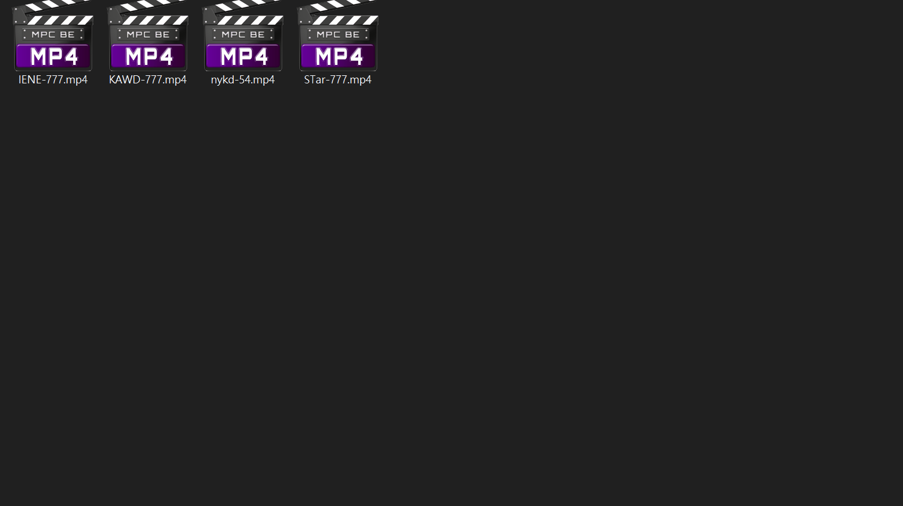

# JAV-Info

> A simple tool to rename local video files by jav unique id(bangou); it can also download album image and thumbnails images

## Demo

- 

## Usage

Download Windows(.exe) version at release(Deprecated❗) or directly use Python

### Requirement

- Python3.6 or newer
- Install packages in `requirements.txt`
- Put correct version of `ChromeDriver.exe` at `Path`
  - Download from <https://chromedriver.chromium.org/downloads>
- Modify `config.json` from `config-template.json`

Usage: `python main.py`

## Config

This program will read config from `config.json`.

You can modify from `config-template.json`.

| Key                      | Description                                                                                                              |
| ------------------------ | ------------------------------------------------------------------------------------------------------------------------ |
| fileDirs                 | Input directories, Unix-like file path is preferred                                                                      |
| getInfoInterval          | Time interval to retrieve data from source website in second, do not set too small                                       |
| fileNameFormat           | Format of new file name, see detail below                                                                                |
| language                 | `tw`, `cn`, `en`, `ja` for javlibrary, english only in javdb                                                             |
| saveAlbum                | Save album image in the same directory of video file                                                                     |
| saveThumb                | Save thumbnails in the same directory of video file                                                                      |
| dryRun                   | Run without real execution                                                                                               |
| maxFileLength            | Maximum file name length in bytes, reduce this value if "file name too long" error happens                               |
| minFileSizeMB            | Minimum file size(in MB) to rename                                                                                       |
| renameCheck              | Ask before every rename operation                                                                                        |
| ignoreWords              | Ignore list of words in filename to prevent parse bangou error, e.g., "1080p-123.mp4" will possibly be parsed as `p-123` |
| retryFailedDB            | Retrieve failed data in database from source website again                                                               |
| javlibraryCookieFilePath | Your logined cookie files from website <https://www.javlibrary.com>                                                      |
| javdbCookieFilePath      | Your logined cookie files from website <https://javdb.com>                                                               |

### Tags in fileNameFormat

Recommend to include `{bangou}` in filename in order to do further renaming.

| Tags       | Description                                                            |
| ---------- | ---------------------------------------------------------------------- |
| {bangou}   | The unique ID of jav                                                   |
| {title}    | Title may include actors' name, guarantee not include bangou           |
| {tags}     | Tags in source website                                                 |
| {director} |                                                                        |
| {maker}    | Maker of the video, often related to the first(english) part of bangou |
| {actors}   |                                                                        |
| {duration} | The length of video in minutes                                         |
| {date}     | Release date                                                           |
| {rating}   | User rating from source website                                        |
| {album}    | Link of album image, **not recommend to use**                          |
| {thumbs}   | Link of thumbnails, **not recommend to use**                           |
| {link}     | Link of information source, **not recommend to use**                   |

## Database

All queries will be saved in `db-{language}.json`.

You can do dry run to check the rename progress and then execute without retrieving data again.

Failed requests will also be saved, so clean the database if something went wrong.

## Note

- Input **filename** should include bangou, or it cannot be renamed
- If there exist multiple files that have the same bangou, they will be renamed with the suffix serial number, ordered by original file name

## Future Work

- Execute
  - fill video metadata in file
  - options for new folder
- FileName
  - fit more types of bangou
- Database
  - use other method instead directly loading into memory
  - find other database which has chinese title
- UI
  - interface to search local database

## Source Website

- [javlibrary](https://www.javlibrary.com)
- [javdb](https://javdb.com)